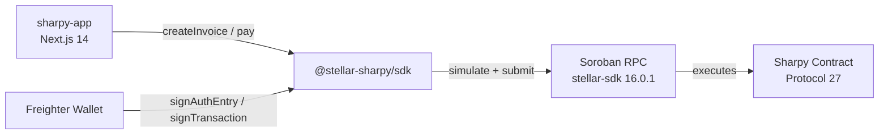

# @stellar-sharpy/sdk


TypeScript SDK for the **Sharpy** advanced split payment contract on Stellar Soroban. Wraps all contract interactions, wallet integration, and x402 agentic payment support into a clean, fully-typed API.


---

## Architecture



---

## Install

```bash
npm install @stellar-sharpy/sdk
```

- [Frontend dApp](https://sharpy-sigma.vercel.app)
- [Pitch Deck](https://gamma.app/docs/Split-Payments-on-Stellar-s0et8z1agtva59n)

---

## Quick Start

```typescript
import { SharpyClient, connectWallet, deadlineFromDays, parseAmount, NETWORKS } from "@stellar-sharpy/sdk";

// Connect Freighter wallet
const publicKey = await connectWallet();

// Initialize client — testnet pre-configured
const client = new SharpyClient(NETWORKS.testnet);

// Create a split invoice — 60/40 between two recipients
const { invoiceId, txHash } = await client.createInvoice({
  creator: publicKey,
  recipients: [
    { address: "GABC...RECIPIENT1", amount: parseAmount("600") },
    { address: "GDEF...RECIPIENT2", amount: parseAmount("400") },
  ],
  token: "USDC_CONTRACT_ADDRESS",
  deadline: deadlineFromDays(7),
});

console.log(`Invoice #${invoiceId} created: ${txHash}`);

// Pay the invoice
await client.pay(publicKey, invoiceId, parseAmount("1000"));

// Fetch status
const invoice = await client.getInvoice(invoiceId);
console.log(invoice.status); // "Released"
```

---

## API Reference

### `SharpyClient`

```typescript
new SharpyClient(config: SharpyClientConfig)
```

| Field | Type | Description |
|-------|------|-------------|
| `rpcUrl` | `string` | Soroban RPC endpoint |
| `networkPassphrase` | `string` | Stellar network passphrase |
| `contractId` | `string` | Deployed contract ID |

#### Invoice Methods

| Method | Returns | Description |
|--------|---------|-------------|
| `createInvoice(params)` | `Promise<{ invoiceId, txHash }>` | Create a new invoice with split rules and escrow options |
| `createBatch(creator, invoices[])` | `Promise<{ invoiceIds, txHash }>` | Create up to 10 invoices in one transaction |
| `createRecurring(params)` | `Promise<{ invoiceId, txHash }>` | Create recurring invoice with auto-generation on release |
| `cancelInvoice(caller, invoiceId)` | `Promise<{ txHash }>` | Creator cancels invoice and refunds all payments |

#### Payment Methods

| Method | Returns | Description |
|--------|---------|-------------|
| `pay(payer, invoiceId, amount)` | `Promise<{ txHash }>` | Pay toward an invoice |
| `poolPay(payer, payments[])` | `Promise<{ txHash }>` | Pay multiple invoices in one call |
| `releaseEscrow(caller, invoiceId)` | `Promise<{ txHash }>` | Release escrow-held funds after delay |
| `refund(caller, invoiceId)` | `Promise<{ txHash }>` | Refund invoice after deadline |

#### Escrow & Dispute Methods

| Method | Returns | Description |
|--------|---------|-------------|
| `disputeRelease(caller, invoiceId)` | `Promise<{ txHash }>` | Raise an escrow dispute |
| `resolveDispute(caller, invoiceId, release)` | `Promise<{ txHash }>` | Arbitrator resolves dispute |

#### Read Methods

| Method | Returns | Description |
|--------|---------|-------------|
| `getInvoice(id)` | `Promise<Invoice>` | Fetch full invoice state by ID |
| `getInvoiceStats(id)` | `Promise<InvoiceStats>` | Fetch funded/total/completion_bps/unique_payers |
| `getAuditLog(id)` | `Promise<AuditEntry[]>` | Full on-chain audit trail |
| `getPayerTotal(id, payer)` | `Promise<bigint>` | Total amount paid by a specific address |
| `getNextRecurring(id)` | `Promise<number \| null>` | Next invoice ID in recurring chain |
| `getInvoiceFingerprint(id)` | `Promise<string>` | SHA-256 content hash (Protocol 25/26) |

#### Protocol 25/26 Methods

| Method | Returns | CAP | Description |
|--------|---------|-----|-------------|
| `bumpInvoiceTtl(caller, invoiceId)` | `Promise<{ txHash }>` | CAP-78 | Extend invoice storage TTL to prevent archival |
| `getInvoiceFingerprint(invoiceId)` | `Promise<string>` | CAP-75/82 | SHA-256 tamper-evident content hash |

---

### Wallet Helpers

| Function | Returns | Description |
|----------|---------|-------------|
| `connectWallet()` | `Promise<string>` | Connect Freighter, return public key |
| `getWalletPublicKey()` | `Promise<string \| null>` | Get currently connected public key |
| `signTransaction(xdr, passphrase)` | `Promise<string>` | Sign a transaction XDR |

---

### Utilities

| Function | Description |
|----------|-------------|
| `parseAmount(value)` | Parse USDC string to stroops (bigint) — `"10.5"` → `105_000_000n` |
| `formatAmount(stroops)` | Format stroops as USDC string — `105_000_000n` → `"10.5"` |
| `deadlineFromDays(days)` | Unix timestamp N days from now |
| `isExpired(deadline)` | Check if a deadline has passed |
| `isValidAddress(address)` | Validate a Stellar G... address |
| `truncateAddress(address)` | Truncate for display: `GABC...XYZ` |
| `explorerUrl(network, id, type)` | Build Stellar Expert explorer URL |

---

### NETWORKS Constant

```typescript
import { NETWORKS } from "@stellar-sharpy/sdk";

// Testnet — pre-configured with deployed contract ID
const client = new SharpyClient(NETWORKS.testnet);
// { rpcUrl, networkPassphrase, contractId }

// Mainnet
const client = new SharpyClient(NETWORKS.mainnet);
```

---

### Error Handling

The SDK exports typed error classes for graceful handling:

```typescript
import {
  InvoiceNotFoundError,
  DeadlinePassedError,
  InvoiceNotPendingError,
  OverpaymentError,
} from "@stellar-sharpy/sdk";

try {
  await client.pay(publicKey, invoiceId, parseAmount("100"));
} catch (e) {
  if (e instanceof DeadlinePassedError) {
    console.error("Invoice deadline has passed");
  } else if (e instanceof OverpaymentError) {
    console.error("Payment exceeds remaining balance");
  }
}
```

---

### Types

```typescript
interface Invoice {
  version: number;
  creator: string;
  recipients: string[];
  amounts: bigint[];
  tokens: string[];
  deadline: number;
  funded: bigint;
  status: "Pending" | "Released" | "Refunded" | "Cancelled";
  escrowEnabled: boolean;
  escrowReleaseDelay: number;
  completionTime?: number;
}

type SplitRule =
  | { type: "Fixed"; amount: bigint }
  | { type: "Percentage"; bps: number }
  | { type: "Tiered"; threshold: bigint; bps: number };

interface AuditEntry {
  action: string;
  actor: string;
  timestamp: number;
}
```

---

## Build & Development

```bash
npm run build    # tsup — ESM + CJS + TypeScript declarations
npm run dev      # watch mode
npm run lint     # tsc --noEmit
npm test         # vitest
```

---

## Protocol Compatibility

| stellar-sdk | Protocol | Status |
|-------------|----------|--------|
| 16.0.1 | 27 | ✅ Current |

---

## Related Repos

| Repo | Description |
|------|-------------|
| [sharpy-contracts](https://github.com/stellar-sharpy/sharpy-contracts) | Soroban smart contract (Rust) |
| [sharpy-app](https://github.com/stellar-sharpy/sharpy-app) | Next.js 14 frontend dApp |

---

## Contributing

See [CONTRIBUTING.md](CONTRIBUTING.md) for setup, standards, and commit conventions.

## Security

See [SECURITY.md](SECURITY.md) for the vulnerability disclosure process.

## License

[MIT](LICENSE)
