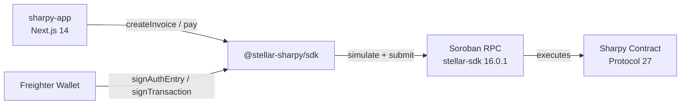

# @stellar-sharpy/sdk


[](https://www.loom.com/share/09aa4a78e0c944dcab866a7036fde24d)

TypeScript SDK for the **Sharpy** advanced split payment contract on Stellar Soroban. Wraps all contract interactions, wallet integration, and x402 agentic payment support into a clean, fully-typed API.


---

## Architecture


```mermaid
graph LR
    App["sharpy-app\nNext.js 14"]
    SDK["@stellar-sharpy/sdk"]
    Freighter["Freighter Wallet"]
    RPC["Soroban RPC\nstellar-sdk 16.0.1"]
    Contract["Sharpy Contract\nProtocol 27"]

    App -->|"createInvoice / pay"| SDK
    Freighter -->|"signAuthEntry / signTransaction"| SDK
    SDK -->|"simulate + submit"| RPC
    RPC -->|"executes"| Contract
```

---

## Install

```bash
npm install @stellar-sharpy/sdk
```

- [Frontend dApp](https://sharpy-sigma.vercel.app)
- [Pitch Deck](https://gamma.app/docs/Split-Payments-on-Stellar-s0et8z1agtva59n)
- [Demo Video](https://www.loom.com/share/09aa4a78e0c944dcab866a7036fde24d)

### 🎯 Live Testnet Transactions

See the SDK in action with real on-chain transactions:

- [Create Invoice #3](https://stellar.expert/explorer/testnet/tx/ce46bcef570a4c05f6348081126135c9f24165c5e470a6b51b923f423156c5da) — Basic invoice creation
- [Batch Creation](https://stellar.expert/explorer/testnet/tx/97cee323bb5443ddc8439f9d99f5a34e585f8cf74872a6138c5f1456adb5ab90) — Multiple invoices in one call
- [Multi-recipient Split](https://stellar.expert/explorer/testnet/tx/785d079c53350fdf50db1e6d92da2219e148b204b87b6448632d1e21a94faac4) — Split payment to multiple addresses
- [Escrow Protection](https://stellar.expert/explorer/testnet/tx/db19f9206a4a25b4431b6a3dfae25080f3c20a285249521aac5e593f1c26e76c) — Invoice with time-locked escrow
- [Recurring Billing](https://stellar.expert/explorer/testnet/tx/2f5e2344337de8f4c578f5d91861db4425ebcfcf967b4d1430c0434d9e77ea64) — Subscription invoice setup

**Test Account**: [GD4Q2BH6...RS63](https://stellar.expert/explorer/testnet/account/GD4Q2BH6KISIHTZWV5CSUMZC7VUBQAAXPNVSCESTUGH5WEYALMOTRS63)

---

## Quick Start

```typescript
import { SharpyClient, connectWallet, deadlineFromDays, parseAmount, NETWORKS } from "@stellar-sharpy/sdk";

// Connect Freighter wallet
const publicKey = await connectWallet();

// Initialize client — testnet pre-configured
const client = new SharpyClient(NETWORKS.testnet);

// Create a split invoice — 60/40 between two recipients
const { invoiceId, txHash } = await client.createInvoice({
  creator: publicKey,
  recipients: [
    { address: "GABC...RECIPIENT1", amount: parseAmount("600") },
    { address: "GDEF...RECIPIENT2", amount: parseAmount("400") },
  ],
  token: "USDC_CONTRACT_ADDRESS",
  deadline: deadlineFromDays(7),
});

console.log(`Invoice #${invoiceId} created: ${txHash}`);

// Pay the invoice
await client.pay(publicKey, invoiceId, parseAmount("1000"));

// Fetch status
const invoice = await client.getInvoice(invoiceId);
console.log(invoice.status); // "Released"

// Create a vesting stream — 1000 USDC over 30 days
const { streamId } = await client.createStream({
  creator: publicKey,
  recipient: "GDEF...RECIPIENT",
  token: "USDC_CONTRACT_ADDRESS",
  totalAmount: parseAmount("1000"),
  startAt: Math.floor(Date.now() / 1000),
  endAt: deadlineFromDays(30),
});
```

---

## API Reference

### `SharpyClient`

```typescript
new SharpyClient(config: SharpyClientConfig)
```

| Field | Type | Description |
|-------|------|-------------|
| `rpcUrl` | `string` | Soroban RPC endpoint |
| `networkPassphrase` | `string` | Stellar network passphrase |
| `contractId` | `string` | Deployed contract ID |

#### Invoice Methods

| Method | Returns | Description |
|--------|---------|-------------|
| `createInvoice(params)` | `Promise<{ invoiceId, txHash }>` | Create a new invoice with split rules and escrow options |
| `createBatch(creator, invoices[])` | `Promise<{ invoiceIds, txHash }>` | Create up to 10 invoices in one transaction |
| `createRecurring(params)` | `Promise<{ invoiceId, txHash }>` | Create recurring invoice with auto-generation on release |
| `cancelInvoice(caller, invoiceId)` | `Promise<{ txHash }>` | Creator cancels invoice and refunds all payments |

#### Payment Methods

| Method | Returns | Description |
|--------|---------|-------------|
| `pay(payer, invoiceId, amount)` | `Promise<{ txHash }>` | Pay toward an invoice |
| `poolPay(payer, payments[])` | `Promise<{ txHash }>` | Pay multiple invoices in one call |
| `releaseEscrow(caller, invoiceId)` | `Promise<{ txHash }>` | Release escrow-held funds after delay |
| `refund(caller, invoiceId)` | `Promise<{ txHash }>` | Refund invoice after deadline |

#### Escrow & Dispute Methods

| Method | Returns | Description |
|--------|---------|-------------|
| `disputeRelease(caller, invoiceId)` | `Promise<{ txHash }>` | Raise an escrow dispute |
| `resolveDispute(caller, invoiceId, release)` | `Promise<{ txHash }>` | Arbitrator resolves dispute |

#### Read Methods

| Method | Returns | Description |
|--------|---------|-------------|
| `getInvoice(id)` | `Promise<Invoice>` | Fetch full invoice state by ID |
| `getInvoiceStats(id)` | `Promise<InvoiceStats>` | Fetch funded/total/completion_bps/unique_payers |
| `getAuditLog(id)` | `Promise<AuditEntry[]>` | Full on-chain audit trail |
| `getPayerTotal(id, payer)` | `Promise<bigint>` | Total amount paid by a specific address |
| `getNextRecurring(id)` | `Promise<number \| null>` | Next invoice ID in recurring chain |
| `getInvoiceFingerprint(id)` | `Promise<string>` | SHA-256 content hash (Protocol 25/26) |
| `previewPayout(id, amount)` | `Promise<bigint[]>` | Preview exact per-recipient payouts with dust-correct rounding |
| `getInvoicesByCreator(creator)` | `Promise<number[]>` | Fetch all invoice IDs created by an address (on-chain index) |
| `getClaimableBalance(account, token)` | `Promise<bigint>` | Query internal credited balance after failed transfer |

#### Fallback Recovery Methods

| Method | Returns | Description |
|--------|---------|-------------|
| `claim(account, token)` | `Promise<{ amount, txHash }>` | Withdraw credited balance after failed recipient transfer |
| `getClaimableBalance(account, token)` | `Promise<bigint>` | Query claimable balance for account/token |

#### Protocol 25/26 Methods

| Method | Returns | CAP | Description |
|--------|---------|-----|-------------|
| `bumpInvoiceTtl(caller, invoiceId)` | `Promise<{ txHash }>` | CAP-78 | Extend invoice storage TTL to prevent archival |
| `getInvoiceFingerprint(invoiceId)` | `Promise<string>` | CAP-75/82 | SHA-256 tamper-evident content hash |
| `previewPayout(invoiceId, amount)` | `Promise<bigint[]>` | CAP-82 | Preview split distribution with checked arithmetic |

#### Streaming Methods

| Method | Returns | Description |
|--------|---------|-------------|
| `createStream(params)` | `Promise<{ streamId, txHash }>` | Create a linear-vesting token stream |
| `withdrawVested(caller, streamId)` | `Promise<{ txHash }>` | Withdraw vested amount for a stream |
| `cancelStream(caller, streamId)` | `Promise<{ txHash }>` | Cancel a stream and reclaim unvested funds |
| `topUpStream(caller, streamId, amount)` | `Promise<{ txHash }>` | Add funds to an existing stream |

```typescript
const { streamId } = await client.createStream({
  creator: publicKey,
  recipient: "GDEF...RECIPIENT",
  token: "USDC_CONTRACT_ADDRESS",
  totalAmount: parseAmount("1000"),
  startAt: Math.floor(Date.now() / 1000),
  endAt: deadlineFromDays(30),
});
await client.withdrawVested(publicKey, streamId);
await client.topUpStream(publicKey, streamId, parseAmount("100"));
await client.cancelStream(publicKey, streamId);
```

#### React Streaming Hooks (`@stellar-sharpy/react`)

```tsx
import { useCreateStream, useWithdrawVested, useCancelStream, useTopUpStream } from "@stellar-sharpy/react";

const { create, loading, data } = useCreateStream(client);
const { withdraw } = useWithdrawVested(client);
const { cancel } = useCancelStream(client);
const { topUp } = useTopUpStream(client);
```

#### React CCTP Hooks (`@stellar-sharpy/react`)

```tsx
import { useCctpHookData, useCctpAttestation, useCompleteCctpInbound } from "@stellar-sharpy/react";

const { build } = useCctpHookData(client);
const hookData = build("GDEF...FORWARD_RECIPIENT");
const { poll, data: att } = useCctpAttestation(client);
await poll(evmTxHash, 6); // Base domain
const { complete } = useCompleteCctpInbound(client);
await complete(caller, att.message, att.attestation);
```

##### CCTP end-to-end (EVM → Stellar)

1. Build `hookData` with `client.buildCctpHookData(forwardRecipient)` and pass it to the EVM `depositForBurnWithHook` call (mintRecipient = destinationCaller = CctpForwarder).
2. Wait for Circle attestation with `pollCctpAttestation(evmTxHash, sourceDomain)` or `useCctpAttestation`.
3. Complete on Stellar with `completeCctpInbound(caller, message, attestation)` or `useCompleteCctpInbound`.

#### React Invoice Hooks (`@stellar-sharpy/react`)

```tsx
const { invoice, invoiceId, loading, error, refresh } = useInvoice(client, id, {
  refreshInterval: 10_000,
  refreshOnIdChange: true,
});
const { ids, total, creator, loading: listLoading } = useInvoicesByCreator(client, creatorAddr, {
  limit: 10,
  offset: 0,
});
```

---

### Wallet Helpers

| Function | Returns | Description |
|----------|---------|-------------|
| `connectWallet()` | `Promise<string>` | Connect Freighter, return public key |
| `getWalletPublicKey()` | `Promise<string \| null>` | Get currently connected public key |
| `signTransaction(xdr, passphrase)` | `Promise<string>` | Sign a transaction XDR |

---

### Utilities

| Function | Description |
|----------|-------------|
| `parseAmount(value)` | Parse USDC string to stroops (bigint) — `"10.5"` → `105_000_000n` |
| `formatAmount(stroops)` | Format stroops as USDC string — `105_000_000n` → `"10.5"` |
| `deadlineFromDays(days)` | Unix timestamp N days from now |
| `isExpired(deadline)` | Check if a deadline has passed |
| `isValidAddress(address)` | Validate a Stellar G... address |
| `truncateAddress(address)` | Truncate for display: `GABC...XYZ` |
| `explorerUrl(network, id, type)` | Build Stellar Expert explorer URL |

---

### NETWORKS Constant

```typescript
import { NETWORKS } from "@stellar-sharpy/sdk";

// Testnet — pre-configured with deployed contract ID
const client = new SharpyClient(NETWORKS.testnet);
// { rpcUrl, networkPassphrase, contractId }

// Mainnet
const client = new SharpyClient(NETWORKS.mainnet);
```

---

### Error Handling

The SDK exports typed error classes for graceful handling:

```typescript
import {
  InvoiceNotFoundError,
  DeadlinePassedError,
  InvoiceNotPendingError,
  OverpaymentError,
  StreamingNotFoundError,
  StreamingInvalidArgsError,
  StreamingPausedError,
  StreamingNotInitializedError,
} from "@stellar-sharpy/sdk";

try {
  await client.pay(publicKey, invoiceId, parseAmount("100"));
} catch (e) {
  if (e instanceof DeadlinePassedError) {
    console.error("Invoice deadline has passed");
  } else if (e instanceof OverpaymentError) {
    console.error("Payment exceeds remaining balance");
  }
}

try {
  await client.withdrawVested(publicKey, streamId);
} catch (e) {
  if (e instanceof StreamingNotFoundError) {
    console.error("Stream does not exist");
  } else if (e instanceof StreamingPausedError) {
    console.error("Stream is paused");
  } else if (e instanceof StreamingInvalidArgsError) {
    console.error("Bad streaming args");
  }
}
```

---

### Types

```typescript
interface Invoice {
  version: number;
  creator: string;
  recipients: string[];
  amounts: bigint[];
  tokens: string[];
  deadline: number;
  funded: bigint;
  status: "Pending" | "Released" | "Refunded" | "Cancelled";
  escrowEnabled: boolean;
  escrowReleaseDelay: number;
  completionTime?: number;
}

type SplitRule =
  | { type: "Fixed"; amount: bigint }
  | { type: "Percentage"; bps: number }
  | { type: "Tiered"; threshold: bigint; bps: number };

interface AuditEntry {
  action: string;
  actor: string;
  timestamp: number;
}
```

---

## Build & Development

```bash
npm run build    # tsup — ESM + CJS + TypeScript declarations
npm run dev      # watch mode
npm run lint     # tsc --noEmit
npm test         # vitest
```

---

## Module Overview

The SDK ships 35 focused utility modules alongside the core client:

| Module | Description |
|--------|-------------|
| `client.ts` | `SharpyClient` — all contract methods |
| `wallet.ts` | Freighter v3 wallet helpers |
| `utils.ts` | `parseAmount`, `formatAmount`, `deadlineFromDays`, etc. |
| `errors.ts` | Typed error classes |
| `retrylogic.ts` | Automatic retry for failed transactions |
| `batchoperations.ts` | Batch operation helpers |
| `eventlisteners.ts` | Contract event listener utilities |
| `walletdetection.ts` | Wallet detection utilities |
| `amountformatting.ts` | Amount formatting helpers |
| `addressutils.ts` | Address validation utilities |
| `transactionbuilder.ts` | Transaction builder utilities |
| `simulationhelpers.ts` | Transaction simulation helpers |
| `errorrecovery.ts` | Error recovery mechanisms |
| `cachelayer.ts` | Response caching layer |
| `paginationhelpers.ts` | Pagination utilities |
| `typeguards.ts` | TypeScript type guard functions |
| `networkswitching.ts` | Network switching utilities |
| `webhooksupport.ts` | Webhook payload builders |
| `invoicebuilders.ts` | Invoice builder patterns |
| `asynchelpers.ts` | Async operation helpers |
| `timeoutconfig.ts` | Configurable timeouts |
| `loggingutils.ts` | Debug logging utilities |
| `estimatefees.ts` | Fee estimation helpers |
| `memosupport.ts` | Transaction memo support |
| `sorobanutils.ts` | Soroban utility functions |
| `contractinterfaces.ts` | Contract interface types |

---

## Protocol Compatibility

| stellar-sdk | Protocol | Status |
|-------------|----------|--------|
| 16.0.1 | 27 | ✅ Current |

---

## Related Repos

| Repo | Description |
|------|-------------|
| [sharpy-contracts](https://github.com/stellar-sharpy/sharpy-contracts) | Soroban smart contract (Rust) |
| [sharpy-app](https://github.com/stellar-sharpy/sharpy-app) | Next.js 14 frontend dApp |

---

## Contributing

See [CONTRIBUTING.md](CONTRIBUTING.md) for setup, standards, and commit conventions.

## Security

See [SECURITY.md](SECURITY.md) for the vulnerability disclosure process.

## License

[MIT](LICENSE)

## Invoice Tags SDK

- `getInvoiceTags(invoiceId)` — fetch tags
- `setInvoiceTags(caller, invoiceId, tags)` — set tags

- `sdk-memo-ext` — feat(sdk): memo ext — get/setInvoiceMemoExt

- `sdk-batch-refund` — feat(sdk): batch refund — refundBatch

- `sdk-extend-deadline` — feat(sdk): extend deadline — extendDeadline

- `feat/sdk-metadata` — feat(sdk): metadata — get/setInvoiceMetadata

- `feat/sdk-discount` — feat(sdk): discount — get/setDiscount

- `feat/sdk-recurring-pause` — feat(sdk): recurring pause — pause/resume

- `feat/sdk-template` — feat(sdk): template — create/getTemplate

- `feat/sdk-approval` — feat(sdk): approval — set/approve/getApproval

- `feat/sdk-archival` — feat(sdk): archival — archive/isArchived/unarchive
